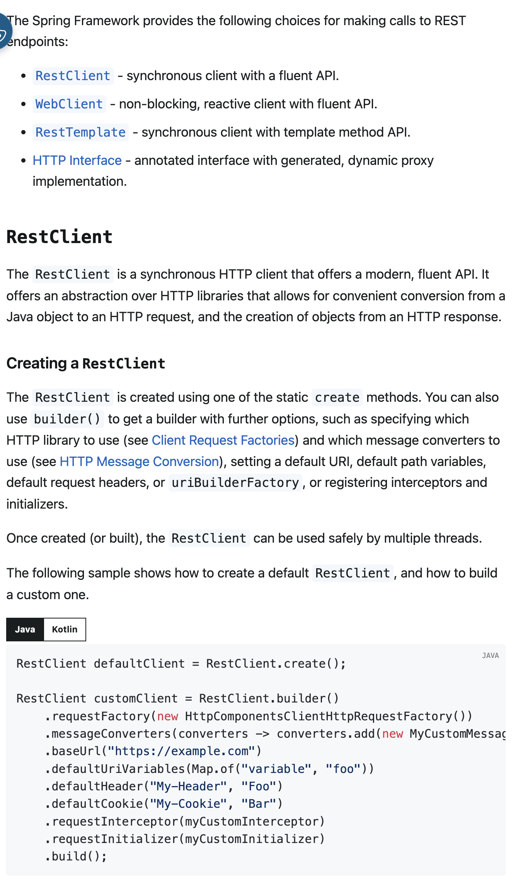
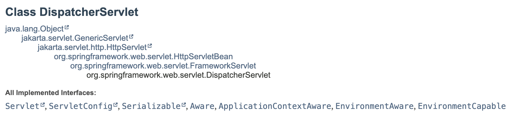
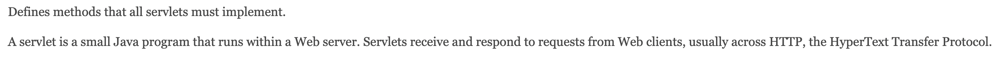

# 공식문서 사용설명서: 블로그/AI 디버깅은 이제 그만!

- 이 글은 블로그 글과 생성형 AI에 의존하여 학습/디버깅하는 개발자들을 설득하기 위해 작성된 글입니다.
- 개인적인 경험을 중심으로 작성되었습니다.
---
# 들어가며

초등학교부터 고등학교까지, 제게 공부는 정해진 길을 따라가는 과정이었습니다. 교과서와 선생님이 이끄는대로 노력하면 성적이라는 명확한 결과로 돌아왔습니다. 그것이 '학습'이라고 자연스럽게 믿었습니다. 하지만 대학에 입학하며 모든 것이 낯설어졌습니다. 누구도 정답을 알려주지 않았고, 무엇을 어떻게 공부해야 할지 모호했습니다. 문제의 해설은 물론, 답도 알려주지 않는 전공 원서는 불친절하게 느껴졌고, 저는 유튜브 강의나 요약된 자료에 의존하며 시험을 준비했습니다. 솔직히 말해서, 근본적인 학습의 즐거움을 잃어버린 채, 졸업만을 목표로 시간을 보냈습니다.

레벨 2 과정에서 코치님들은 학습법의 중요성을 강조했습니다. "지식 한 줄보다 학습 역량을 쌓는 것이 더 중요합니다." 그 해결책으로 제시된 것이 바로 '공식 문서 학습법'이었습니다. 항상 내 것으로 만들고 싶었던 대상이었기에, 이번 기회에 공식 문서를 정복한다면 큰 성장을 이룰 수 있으리라 생각했습니다.

저는 블로그나 생성형 AI의 도움 없이 오직 공식 문서만으로 과제를 해결하는 도전을 시작했습니다. 처음에는 영어로 된 낯선 문서들을 이해하기 어려워 수없이 유혹에 흔들렸습니다. 하지만 과거처럼 방향을 잃고 싶지 않았기에 포기하지 않았습니다. 문장 하나하나를 곱씹으며 집중하자, 점차 문서의 구조와 의도가 보이기 시작했습니다. 필요한 정보를 더 빠르게 찾게 되었고, 어느새 저만의 학습 노하우를 동료들에게 공유하고 있었습니다.

그때 깨달았습니다. 이 능동적인 학습법이야말로 대학 시절 교수님들이 원했던 역량이 아니었을까. 과거에 불친절하다고만 여겼던 전공 원서가, 사실은 가장 정제된 고급 정보로 가득 찬 보물창고였다는 것을요. 이 글은 과거의 저처럼 공식 문서를 '넘어야 할 산'으로 여기는 개발 입문자, 그리고 주니어 개발자분들을 위해 작성되었습니다.

---
# 0. 배경: 우리가 마주하는 문제들

개발 중 문제가 생겼을 때, 어떻게 해결하시나요?

아마 많은 분들이 일단 구글에서 검색한 블로그 글이나 생성형 AI에게 먼저 손을 내밀 겁니다.

물론 간단하고 일반적인 문제, 혹은 사용자가 많은 기술이라면 이 방법이 가장 빠를 수 있습니다. 특히 "이렇게 하세요"라는 결론만 쏙 빼내어 코드를 복사/붙여넣기만 해도 일단 문제가 해결되니, 그 유혹은 더 달콤하죠. 굳이 원리를 이해하려 애쓰지 않아도 되니까요.

하지만 우리가 마주하는 문제가 그렇게 만만하던가요?

만약 갓 나온 신기술이라 참고할 만한 글이 거의 없다면 어떨까요? 기존 기술이 'Deprecated' 되어 새로운 방식으로 갈아타야 하는데, 그에 대한 자료가 없다면요?

이런 상황에선 AI도 명쾌한 답을 주기 어렵습니다. 학습한 데이터가 없으니까요. 설령 검색에 걸린 몇 안 되는 글이 있다 한들, 과연 그 내용을 신뢰할 수 있을까요?

자, 그럼 이제 어떻게 해야 할까요? 막막한 심정으로 코드를 직접 뜯어봐야 할까요? 아니면 누군가 친절한 블로그 글이나 강의를 만들어 줄 때까지 하염없이 기다려야 할까요? 그 답은 공식 문서에 있습니다.

## 1. 공식 문서란 무엇이고 어디서 찾는가?

## 공식문서란?

공식 문서란 특정 기술이나 프레임워크를 만든 개발자나 조직이 직접 작성한 공식 설명서입니다. 이는 '원작자가 쓴 제품 설명서'와 같아요.

단순한 API 목록을 넘어, 해당 기술을 올바르게 이해하고 활용하는 데 필요한 모든 정보를 담고 있습니다. 그래서 시간이 될 때 익숙한 기술의 철학이나 개발 배경을 읽어보면, 그 기술이 추구하는 바와 향후 발전 방향까지 파악할 수 있습니다.

## 원하는 공식 문서, 어떻게 찾을까요? : 마법의 단어 'docs'

제가 가장 많이 사용하고, 가장 확실하게 추천하는 방법은 검색창에 **'기술명 + docs'** 를 입력하는 것입니다.

예를 들어, 'JdbcTemplate'에 대해 알아보고 싶다면, 검색창에 'JdbcTemplate docs'라고 검색해 보세요. 거의 무조건 Spring 공식 문서가 최상단에 보일 것입니다. (아쉽게도, AWS 같은 거대 글로벌 기업이나 국내 IT 기업들을 제외하면, 잘 갖춰진 한국어 공식 문서는 아직 드뭅니다.)

### 'docs'가 안 보인다면? : 'how to use'

공식 문서는 아니지만, 그에 준하는 공신력을 가진 사이트들도 있습니다. **Wikipedia, MDN** 등이 대표적입니다. Spring을 사용하시는 분들은 'Baeldung'도 추가할 수 있겠네요. 이런 사이트들은 검수를 거쳐 글이 작성되기 때문에, 초기 학습에 활용해보는 것도 좋습니다.

이런 자료를 찾을 때는 'docs' 대신, **'how to use + 기술명'** 으로 검색해 보세요. 'how to use JdbcTemplate'이라고 검색하면, 'Baeldung'에서 작성한 'Spring JDBC Tutorial' 같은 고품질 튜토리얼을 바로 찾을 수 있습니다. 직접 'wiki docs', 'baeldung docs' 등을 붙여 검색하시는 것도 좋습니다.

### TIP: 영어를 선택하세요

Wikipedia처럼 한국어를 지원하는 사이트를 발견하더라도, **웬만하면 영어로 된 원문을 읽기를 강력히 추천합니다.** 대부분의 경우, 한국어 번역본보다 영어로 작성된 원본 내용이 훨씬 더 풍부하고, 자세하며, 정확한 정보를 제공하기 때문입니다.

---  

## 2. 공식 문서, 왜 반드시 읽어야 할까요?

수많은 블로그나 온라인 강의가 있지만, 개발자가 궁극적으로 공식 문서와 친숙해져야 하는 이유는 명확합니다. 공식 문서는 **가장 정확한 성장 경로**를 제시하기 때문입니다.

### **1. 공신력과 정확성**  

공식 문서는 해당 기술을 만든 사람들이 직접 제공하는, 그야말로 **'진실의 원천(Source of Truth)'** 입니다. 기술 면접, 동료와의 토론 등 어떤 상황에서도 의심받지 않을 가장 신뢰도 높은 지식입니다. 다른 모든 자료는 공식 문서를 바탕으로 파생되거나 재가공된 정보이므로, 왜곡되거나 누락된 부분이 존재할 수 있습니다.

### **2. 학습 범위 제시**  

개발을 공부하다 보면 '어디까지 깊게 파고들어야 할까?' 혹은 '이 내용은 너무 지엽적인가?' 하는 고민에 빠지곤 합니다. 공식 문서는 기술 창시자가 '사용자가 이 정도는 이해해야 한다'고 판단하는 핵심 개념과 범위를 명확히 제시합니다. 독자가 어렵다고 느낄 만한 부분에는 어김없이 친절한 예시를 들어 이해를 돕습니다. 우리는 그저 제시된 내용을 믿고 집중해서 학습하기만 하면 됩니다.

### **3. 최신 정보와 기술 변화에 대한 빠른 대응**  

IT 기술은 빠르게 변화합니다. 기존 기능이 변경되거나 새로운 기능이 추가될 때, 공식 문서는 가장 먼저 업데이트됩니다. 특정 기능이 'Deprecated(더 이상 사용되지 않음)' 상태가 되었을 때, 블로그 글에만 의존하는 개발자는 당황할 수밖에 없습니다. 하지만 공식 문서를 활용하는 개발자는 대체할 새로운 기술을 빠르게 파악하고 적용할 수 있습니다.

### **4. '읽는 능력' 자체가 핵심 역량**

결국 개발자의 업무는 끊임없이 새로운 문서를 읽고 이해하는 과정의 연속입니다. 공식 문서를 꾸준히 읽는 습관은 자연스럽게 **기술 문서를 빠르고 정확하게 독해하는 능력**으로 이어집니다. 이는 비단 개발 능력뿐만 아니라, 개발자로서의 기본적인 역량을 강화하는 가장 확실한 훈련입니다.

---  

## 3. 성장을 막는 나쁜 습관들

공식 문서가 가진 장벽에 더해, 우리의 **잘못된 독해 습관**이 성장을 가로막기도 합니다. 아래의 Spring 공식문서를 보고, 스스로 평소에 어떤 식으로 읽어나갔는지 점검해봅시다.

읽으면서, 혹시 아래의 실수를 범하지는 않았는 지 확인해보세요.

-   **예시 코드 먼저 읽기**  
    급한 마음에 설명은 건너뛰고 예시 코드만 읽거나, 가져다 쓰는 경우가 많습니다. 하지만 이는 스스로의 생각과 추측이 개입하여 **지식을 오해하게 만드는 위험한 습관**입니다. 당장의 문제 해결은 가능할지 모르나, **코드의 작동 원리를 이해하지 못했기 때문에 응용이 불가능**합니다. 결국 비슷한 문제가 발생했을 때 다시 검색에 의존하는 악순환에 빠지게 됩니다.

-   **필요한 부분만 선택적으로 읽기**  
    검색을 통해 필요한 정보만 찾아 읽는 방식은 **전체적인 맥락과 구조를 놓치게** 만듭니다. 이는 단편적인 지식에 머무르게 할 뿐만 아니라, 기술의 핵심 철학을 이해하지 못해 잘못된 방식으로 기술을 사용하게 될 위험을 높입니다. 작성자가 글의 중간 부분이 중요하다고 생각했다면, 그 내용은 이미 윗부분으로 올라와 있을 것입니다. 작성자는 당신이 글의 윗부분부터 읽는다고 생각하고 글을 작성했을 것이고, 거기에는 분명한 이유가 있을 거에요. 특별한 이유가 없다면, 위에서부터 정독하는 것을 권장합니다.

어느 정도 알고 있던 기술이라 코드만으로, 부분 발췌독만으로 충분히 이해가 가능하다 생각이 들 수 있습니다. 그렇더라도, 공식 문서를 읽으면서 확실히 지식을 쌓는 다는 마음으로, 시간을 들여 차분히 위에서부터 읽는 것을 권장합니다. 믿음직한 지식을 얻기 위해서 쓰이는 몇 분은 그 가치가 있습니다. 대부분의 공식 문서는 앞선 설명을 읽었다는 전제하에 다음 내용을 서술하므로, 결국 이해가 되지 않아 다시 위로 올라가 읽게 되어 시간을 두 배로 낭비할 수 있습니다. **차근차근 순서대로 읽으며 독해 속도를 높이는 연습**이 중요합니다.
  
---  

## 4. 실전 에시: 공식 문서 사용법

그렇다면 어떻게 해야 공식 문서를 효과적으로 읽고 내 것으로 만들 수 있을까요?

-   **모르는 단어를 인지하고 넘어가자**  
    모르는 단어가 나왔을 때 무시하고 넘어가면, 그 단어는 곧 모르는 문장을 만들고, 모르는 문장은 모르는 문단을 만듭니다. 결국 글 전체가 어렵게 느껴지는 악순환에 빠집니다.

    모르는 단어가 나오면, 의식적으로 **'이해해야 할 단어 목록(TODO)' 을 만들어두는 습관**을 들입시다. 머릿 속으로 기억해도 좋고, 어딘가에 적어두는 것도 좋습니다. 당장 모든 단어를 학습하면 원래의 학습 흐름에서 벗어날 수 있으니, 우선 문맥 속에서 의미를 추측하고 넘어가되, 나중에 반드시 다시 찾아보는 것이 좋습니다. 이 과정을 반복하면 해당 분야의 핵심 어휘가 자연스럽게 체득됩니다.

제가 실제 학습한 경험을 토대로 예시를 한 번 들어보겠습니다. 아래는 Rest Clients에 관한 Spring 공식문서입니다.

처음 이 문서를 접했을 때, 첫 줄에서부터 모르는 단어들을 접했습니다.

> RestClient: synchronus client with a fluent API.

synchronus, fluent 이 두 단어가 '동기적인', '유창한'이라는 의미라는 것은 알았지만, 그게 client라는 맥락에서 어떤 의미인지 이해하지 못했습니다. 이때, 맥락을 통해 추측을 시도해보았습니다. 무작정 의미를 찾기보다, 스스로 가진 지식 내에서 추측해보면, 문맥을 통해 유추해내는 능력도 기르고, 학습 후에 기억에 더 오래 남을 수 있는 방법입니다.

- 동기적인 클라이언트라면, 요청을 보내고 응답을 기다리는 클라이언트를 말하는 것이다.
- 유창한 API라는 건, 잘은 모르지만 세련된 최신 API 기술일 것이다.

그 후에 각 단어에 대해 알아봅니다. 검색창에 'synchronus client docs', 'fluent API docs'라고 검색하여 간략히 각 단어의 의미에 대해 이해합니다. 이를 통해 'synchronus client'는 유추한대로 요청을 보낸 뒤 응답을 기다리는 클라이언트임을 알 수 있었습니다. 또, 'fluent API'라는 것은 Java의 Stream 문법처럼, 메서드 체이닝을 통해 영어 문장을 쓰듯이 메소드를 호출할 수 있도록 설계된 API라는 것을 알 수 있었습니다.

이렇게 단어들을 이해하고 넘어가면서 같은 과정을 반복합니다. 아래는 예시 사고 흐름입니다.

- 'reactive client'는 뭘까? 높은 확률로 'synchronus client'와 대비되는 말일 것 같아.
- 'template method', 'dynamic proxy'라는 건 뭘까.
    - 찾아보니 완벽히 이해하진 못했지만 대충 어떤 건진 알았어. 나중에 더 깊게 알아보고 우선은 마저 글을 읽어봐야지.

모르는 단어를 정확히 이해하고 넘어가는 것은 중요합니다. '대충 이런 뜻이겠지.'하며 넘어간 단어는 문장을 이해하지 못하게 만들고, 그 문장이 문단을, 나아가서 글 전체를 이해하지 못하게 만들기 때문입니다. 또, 잘못 이해한 문장 때문에 글 전체를 오해하며 읽게 되어 시간을 소모할 수도 있습니다. 그러므로 반드시, 의식적으로 모르는 단어가 무엇인지 파악하며, 글을 읽기를 바랍니다.

다시 이어가서, 글을 쭉 읽다가 예시 코드 블록을 발견합니다. 

> 'The following example shows how to create a default RestClient, and how to build a custom one.' 

해당 문장을 읽으며 어떤 예시를 볼 수 있을 지를 짐작하며 아래 예시를 읽어봅니다. 윗문장을 이해하고 무엇이 나올 지를 떠올리며 읽었기 때문에, 코드 블록의 첫 번째 줄이 기본 RestClient(default RestClient)를 생성하는 예시이고, 그 아래는 임의의 Restclient(custom one)를 생성하는 예시라는 것을 알 수 있습니다. 더 나아가서는, 앞서 fluent API에 대해 알아보았던 내용이, 실제로 custom Restclient를 생성할 때에 쓰이고 있다는 것도 확인해볼 수 있습니다.

만약 글을 읽자마자 급한 마음에 예시 코드 블록부터 읽었거나, 모르는 단어가 나왔을 때 대충 넘어갔다면, 같은 문서를 읽더라도 얻어가는 것의 차이는 매우 컸을 것입니다. 글을 이해하는 데에 걸리는 시간도 더 오래걸렸을지도 모릅니다.

**Tip: 자바독(Javadoc)과 같은 트리 구조 문서**   

자바독처럼 클래스 상속 구조를 따르는 문서는 특정 페이지를 바로 열었을 때 이해하기 어려운 경우가 많습니다. 이는 상위 클래스나 인터페이스의 내용을 이미 알고 있다는 전제하에 작성되었기 때문입니다. 이것은 마치 글을 위에서 아래로 읽어야하는 이유와 같습니다. 내용이 이해되지 않는다면, **문서의 상위 계층으로 이동하여 전체적인 맥락을 파악하는 것**이 좋습니다.
가령, DispatcherServlet 공식문서에서는, Servlet이 무엇인지에 대해서 설명해주지는 않습니다.

Servlet에 대해 알아보기 위해서 'Servlet docs'라고 검색해보는 것도 좋은 방법입니다. 그렇지만, 더 확실한 방법으로 우리는 아래의 트리에서 원하는 정보를 얻을 수도 있습니다:

2'All implemented Interfaces:'에 나열된 인터페이스들 중, Servlet을 클릭해서 Servlet에 대한 정의를 찾을 수 있습니다.

---  

## 5. 공식 문서의 한계

물론 공식 문서가 만능은 아닙니다. 다음과 같은 **한계점**도 분명히 존재합니다.

-   **'사용법'을 넘어선 '동작 원리'의 깊이**

    공식 문서는 기본적으로 '일반적인 사용 사례(How-to-Use)'를 중심으로 서술됩니다. 따라서 **내부 동작 원리나 매우 깊은 수준의 최적화**에 대한 내용은 부족할 수 있습니다.

    하지만 이 한계점은 오히려 현명한 학습 가이드라인이 될 수 있습니다. 만약 공식 문서가 특정 내부 원리를 자세히 설명하지 않았다면, 이는 '기술을 만든 사람이 사용자가 굳이 알 필요 없다고 판단했기 때문'일 수 있습니다.

    더군다나, 문서화되지 않은 내부 구현 방식은 언제든 예고 없이(마치 '잠수함 패치'처럼요) 변경될 수 있는 불안정한 지식입니다. 따라서 학습 초기 단계라면, 언제 바뀔지 모르는 세세한 '구현'에 매달리기보다, 기술의 본질이자 약속인 '추상화된 설계도(인터페이스)'에 집중하는 것이 훨씬 효율적이라고 생각합니다.

-   **초기 학습 속도**

    잘 요약된 블로그 글이 당장의 지식을 습득하는 데는 더 빠르고 편할 수 있습니다. 당장 내일까지 결과물을 내야 하는 상황이라면, 두꺼운 공식 문서를 포기하고 싶은 유혹에 빠지기 쉽습니다.

    하지만 남이 소화해서 떠먹여 주는 정보는 **왜곡되거나 중요한 부분이 누락될 위험**이 항상 존재합니다.

    설령 마감에 쫓겨 외부 문서를 참고해 결과물을 제출했더라도, 스스로의 성장을 위해 반드시 공식 문서로 돌아와 같은 내용을 다시 학습해야 합니다. 그 과정에서 '아, 이 내용이 이런 뜻이었구나'하며 오해를 바로잡고, '공식 문서에 실제로 이 말이 적혀 있었구나'하며 정보에 대한 확신을 얻게 됩니다.

초기에는 시간이 더 걸리더라도, 꾸준히 공식 문서를 읽는 연습을 하면 오히려 블로그보다 훨씬 빠르게 원하는 정보를 탐색하고 정확하게 이해하는 자신을 발견하게 될 것입니다. 저도 처음엔 간단한 정보를 찾고 이해하는 데에 몇 시간이 걸리기도 했지만, 지금은 훨씬 빠르게 읽고 학습할 수 있게 되었거든요.

# 마치며

잘 다듬어진 문서는 문장과 문장이 제 역할을 하며 유기적으로 연결됩니다. 처음엔 어렵지만, 집중해서 한 문장씩 곱씹다 보면 어느새 지식이 제 것이 되어 있었습니다. 과장하자면, 지금은 사족이 많은 가벼운 블로그 글이나 AI가 작성한 글이 오히려 느끼하게 느껴질 정도입니다.
저는 주변 동료들에게 '공식 문서 한 줄이 블로그 열 줄이다.' 라고 말합니다. 농담이 조금 섞이긴 했지만, 저는 정말 그렇게 생각합니다.
어렵게 느껴지더라도, 공식문서 학습법에 도전해보세요. 여러분의 앞으로의 개발에 든든한 조력자가 되어 줄 거에요.

---
## References

### Spring 공식 문서

[Rest Client](https://docs.spring.io/spring-framework/reference/integration/rest-clients.html#rest-restclient)
[Dispatcher Servlet](https://docs.spring.io/spring-framework/reference/web/webmvc/mvc-servlet.html#)

### JavaDoc 공식 문서

[Dispatcher Servlet](https://docs.spring.io/spring-framework/docs/current/javadoc-api/org/springframework/web/servlet/DispatcherServlet.html)
[Servlet](https://jakarta.ee/specifications/platform/9/apidocs/jakarta/servlet/servlet)